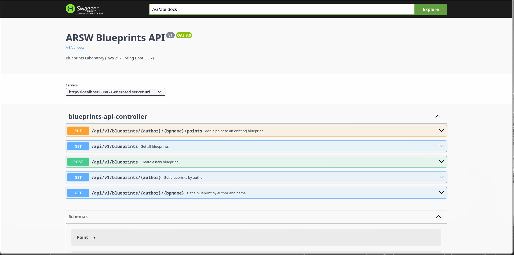

# ARSW Laboratory 04 Part 1 — Blueprints

## Author
- Daniel Patiño Mejía

## Description
This project manages blueprints with a REST service. It extends the original project by adding optional persistence in PostgreSQL, uniform API responses, and automated documentation with OpenAPI/Swagger.

## Features

- **Blueprint Management**: Create, retrieve, update, and filter blueprints.
- **Filtering**: Apply redundancy or undersampling filters to blueprints.
- **Persistence**: Support for both In-Memory and PostgreSQL storage.
- **API Documentation**: Integrated Swagger UI for exploring the REST API.
- **Unified Response**: Standardized JSON response format for all endpoints.

## Project Structure

- src/main/java/edu/eci/arsw/blueprints/controllers: REST Controllers defining the API endpoints.
- src/main/java/edu/eci/arsw/blueprints/services: Business logic and service layer.
- src/main/java/edu/eci/arsw/blueprints/persistence: Data access layer with different implementations (InMemory, Postgres).
- src/main/java/edu/eci/arsw/blueprints/model: Domain entities (Blueprint, Point).
- docker-compose.yml: Definition for the PostgreSQL database container.

## How to Compile and Run

1. Compiling the project:

```bash
# Clone and navigate to directory
git clone https://github.com/daniel-pm19/Lab-04-P1-ARSW.git
cd Lab-04-P1-ARSW

```

2. Using PostgreSQL with Docker we start the database:

First, ensure you have Docker and Docker Compose installed.

To start the database:
```bash
docker-compose up -d
```

This will start a PostgreSQL container with the database blueprints on port 5432.
The application is pre-configured in application.properties to connect to this database.

To stop the database:
```bash
docker-compose down
```

3. Build and run the application:

```bash
# Build
mvn clean install

# Run
mvn spring-boot:run
```


4. OpenAPI/Swagger documentation available at:


http://localhost:8080/swagger-ui.html


## Brief description of work done

- Added JPA dependencies and PostgreSQL driver to pom.xml.

- Implemented JPA entities (BlueprintEntity, PointEntity) and BlueprintRepository.

- Added PostgresBlueprintPersistence implementation (activatable with the postgresql profile) that respects the existing BlueprintPersistence interface.

- The in-memory implementation InMemoryBlueprintPersistence has been retained as the default value to facilitate database-less testing.

- The controller's base path has been changed to /api/v1/blueprints, and the response format has been unified with ApiResponse<T> (JSON with code/message/data).

- Integration with springdoc-openapi and @Operation annotations have been added to endpoints for automated documentation.

- Blueprint filters: IdentityFilter (default), RedundancyFilter (redundancy profile), and UndersamplingFilter (undersampling profile).

## Technologies
- Java 21
- Spring Boot 3.x
- Spring JPA Data
- PostgreSQL (optional)
- springdoc-openapi (Swagger user interface)
- Maven


## Swagger Capture




## Docker Working Capture


